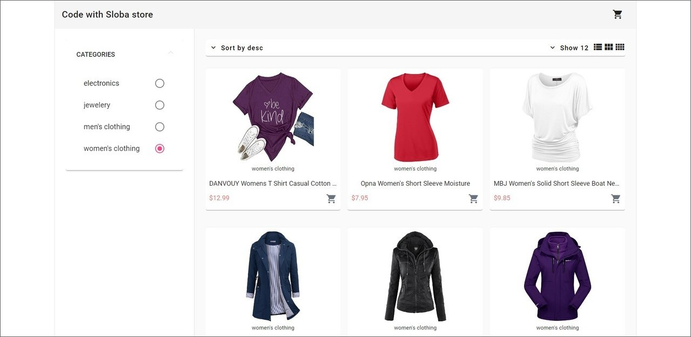
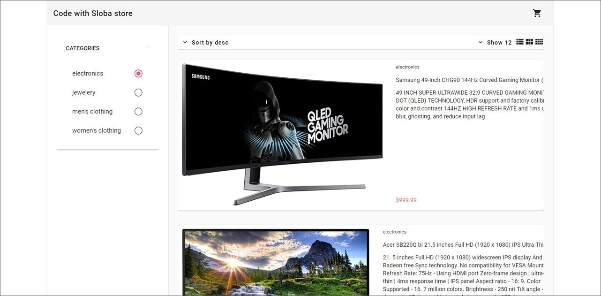
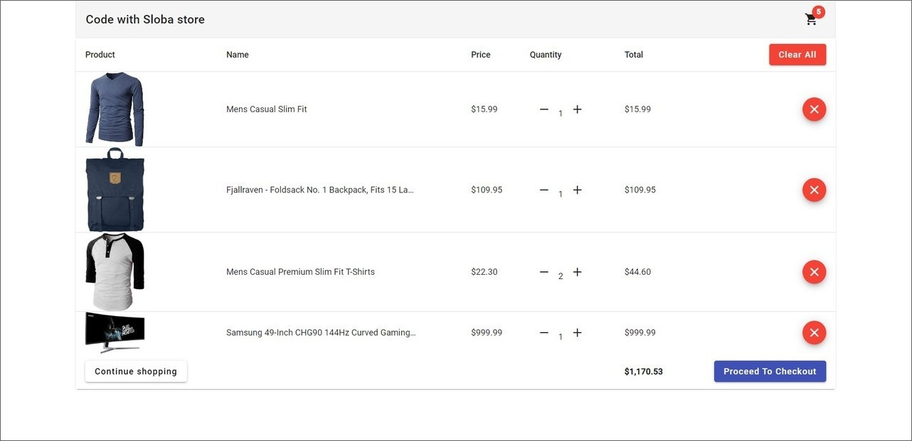

# Store - Angular

Este proyecto es una tienda en línea que permite comprar accesorios de diferentes categorías como camisetas, anillos, bolsos, celulares y más. Se puede filtrar por categoría de productos y cuenta con un carrito de compra para seleccionar los productos a comprar. 

La página está en inglés y se utilizaron tecnologías como Angular, Stripe, Tailwind, Angular Material UI y el API de Fakestoreapi para mostrar los productos con sus precios.

## Tecnologías principales

 Angular  
 Stripe  
 Tailwind  
 Angular Material UI  
 Netlify  

## Capturas de pantalla

A continuación se presentan capturas de pantalla de la página web en desktop:

  
  

  

## Créditos

Este proyecto fue creado a partir del video tutorial de YouTube del canal "freecodecamp.org" en el siguiente enlace: https://www.youtube.com/watch?v=Kbauf9IgsC4&list=PLSvtEtsyp826ID5XmG3Y_YFBNswA1NK77.

## Link

Puedes visitar la página web del proyecto en el siguiente enlace: [URL del sitio](https://1-porfolio-yha.netlify.app/)